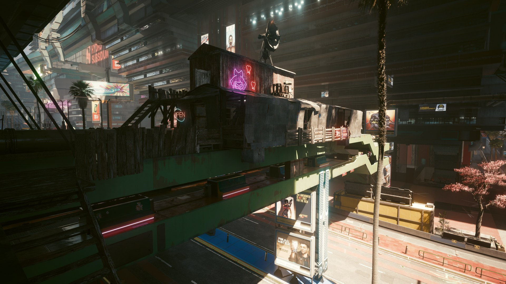

# Homestead

Fallout 4's settlement workshop in Cyberpunk 2077: found a settlement anywhere, hold F, and build with Fallout 4's
workshop pieces and Night City's own props.



**[Watch the demo on YouTube](https://www.youtube.com/watch?v=S9BXaLte25c)**

Nothing of Fallout 4 ships with the mod. Its pieces are converted on your PC, once, from your own Fallout 4 install
by the importer. The only Fallout-derived files in this repository are the menu's thumbnail atlases.

**Download:** [Releases](https://github.com/shawn-makes-stuff/homestead/releases).

## Requirements

- Cyberpunk 2077 (2.3), on Windows
- Fallout 4 installed (Steam, GOG, Epic, Game Pass or the Bethesda launcher). Tested with the next-gen update
  (1.11.240); older versions may work but are untested. Its DLCs add their pieces.
- [Cyber Engine Tweaks](https://www.nexusmods.com/cyberpunk2077/mods/107),
  [RED4ext](https://www.nexusmods.com/cyberpunk2077/mods/2380),
  [redscript](https://www.nexusmods.com/cyberpunk2077/mods/1511),
  [Codeware](https://www.nexusmods.com/cyberpunk2077/mods/7780),
  [TweakXL](https://www.nexusmods.com/cyberpunk2077/mods/4197),
  [Audioware](https://www.nexusmods.com/cyberpunk2077/mods/12001),
  [Native Settings UI](https://www.nexusmods.com/cyberpunk2077/mods/3518)
- About 20 GB free while the first import runs, about 10 GB afterwards

## Install

1. Install the requirements above.
2. Download `Homestead-<version>.zip` from [Releases](https://github.com/shawn-makes-stuff/homestead/releases)
   and install it with your mod manager, or unpack it into your Cyberpunk 2077 folder (the one with `bin`,
   `archive` and `r6` in it). It holds the mod and the importer: the program that makes the pieces from your
   Fallout 4.
3. Start Cyberpunk. On the main menu open **Settings > Mods > Homestead**. It shows where it found Fallout 4
   ("Look again" if that is wrong).
4. Press **Import** on the status line and leave the game at the main menu (about 15-20 minutes the first time; the
   status line shows progress).
5. When it says "Built - quit Cyberpunk to install it", quit the game. It installs as the game closes. Start
   Cyberpunk again: the pieces are there.

Since the import runs while your game does, it can be a bit resource intensive.<br>
Skip the in game install by running the import directly: `bin\x64\plugins\cyber_engine_tweaks\mods\Homestead\importer\HomesteadImport.exe`. 
<br> It has no window; progress is in `...\mods\Homestead\import\fo4\import.log`, and it installs by itself when done.

If the import fails, the status line says why and `import.log` has the details. If pieces look broken, switch on
"Overwrite already imported items" and import again.

## Playing

1. In CET's Bindings, set a key for **Found a settlement here**, stand where you want one and press it.
2. Hold **F** inside the settlement (a 50 m circle, shown as a holographic wall) to enter workshop mode.

| Key | Does |
|---|---|
| E | Place |
| R | Scrap |
| Tab | Back |
| Q | Snap / free placement |
| Left / right mouse | Turn the held piece; step between two snaps on one spot |
| Mouse wheel | Move the held piece further / nearer |
| Ctrl | Move gizmo (free placement) |

Every key can be changed in Settings > Mods > Homestead > Keys. Fallout's pieces are held and snap as in Fallout 4:
the piece floats in the middle of the view, turns with you, and snaps when one of its snap points comes near one
that fits. Placed people are animated props: put one on a seat, a bed or a work stall and they take it up, or give
them one of the game's animations from People > Animations.

More detail: [README_PLAYER.txt](README_PLAYER.txt).

## Updating and uninstalling

Install the new version over the old one. If the update needs an import, the status line and a message in workshop
mode say so; import again and only what changed is remade. Otherwise there is nothing to do.

What you build is kept by Homestead in `mods\Homestead\pieces*.txt`, not inside the game's save (each save knows
which file is its own). Keep those files when you update, and copy them along with your saves.

To uninstall, remove the mod, then `archive\pc\mod\Homestead_FO4.archive`, `archive\pc\mod\Homestead.archive` and
`mods\Homestead`.

## Building from source

Setup:

1. Python 3.11: `pip install numpy scipy pillow trimesh networkx lupa pyinstaller`
2. [WolvenKit CLI](https://github.com/WolvenKit/WolvenKit), a .NET runtime for it, and ffmpeg (an LGPL build for
   releases).
3. For the plugin: Visual Studio (C++), CMake and the [RED4ext SDK](https://github.com/WopsS/RED4ext.SDK).
4. The games are found through the registry and Steam's libraries. Anything not found goes in `homestead_paths.json`
   in the repository root:

```json
{
  "fo4": "D:\\SteamLibrary\\steamapps\\common\\Fallout 4\\Data",
  "cp2077": "C:\\Program Files (x86)\\Steam\\steamapps\\common\\Cyberpunk 2077",
  "wolvenkit": "D:\\tools\\WolvenKit-cli\\WolvenKit.CLI.exe",
  "dotnet": "D:\\tools\\dotnet10",
  "ffmpeg": "C:\\path\\to\\ffmpeg.exe",
  "ffmpeg_lgpl": "D:\\tools\\ffmpeg-lgpl\\ffmpeg.exe"
}
```

Commands (close the game first for anything that installs):

```
python tools/import.py --check       # what was found, nothing done
python tools/import.py               # import from your Fallout 4 and install into Cyberpunk
python tools/import.py --mod-only    # only the mod's own files (Lua, scripts, plugin)
python -X faulthandler tools/sim.py  # tests; needs an import first (they read the generated catalog)
cmake -S plugin -B plugin/build -DRED4EXT_SDK=<path to RED4ext.SDK>
cmake --build plugin/build --config Release
python tools/release.py              # dist/Homestead-<version>.zip
```

An import redoes only the steps whose code or inputs changed.

## Layout

| Path | What |
|---|---|
| `bin/x64/plugins/cyber_engine_tweaks/mods/Homestead/` | The mod: CET Lua (`init.lua`, `modules/`) |
| `r6/` | redscript and TweakXL files |
| `plugin/` | RED4ext plugin (starts the importer, mouse capture, key names) |
| `tools/import.py` | The importer: Fallout 4's pieces, the catalog, the archives, install |
| `tools/fo4/` | Fallout 4 readers and converters (BA2, NIF, Havok, materials, textures) |
| `tools/release.py` | Builds the player's zip (frozen importer and bundled tools) |
| `tools/sim.py` | The test suite: the mod's Lua run against a mock of the game |
| `source/` | Data the importer ships: the Night City catalog, thumbnails, entity templates |

Linux: the importer does not run natively (Windows registry, Windows tools). Under Proton it is untested.
